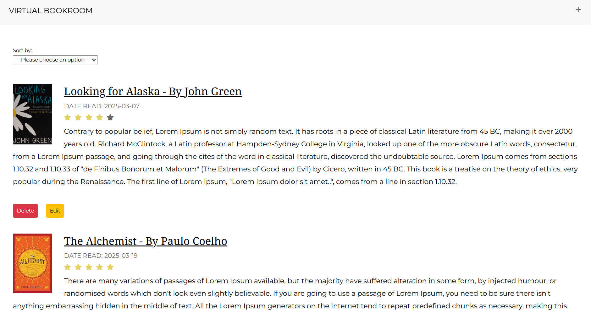
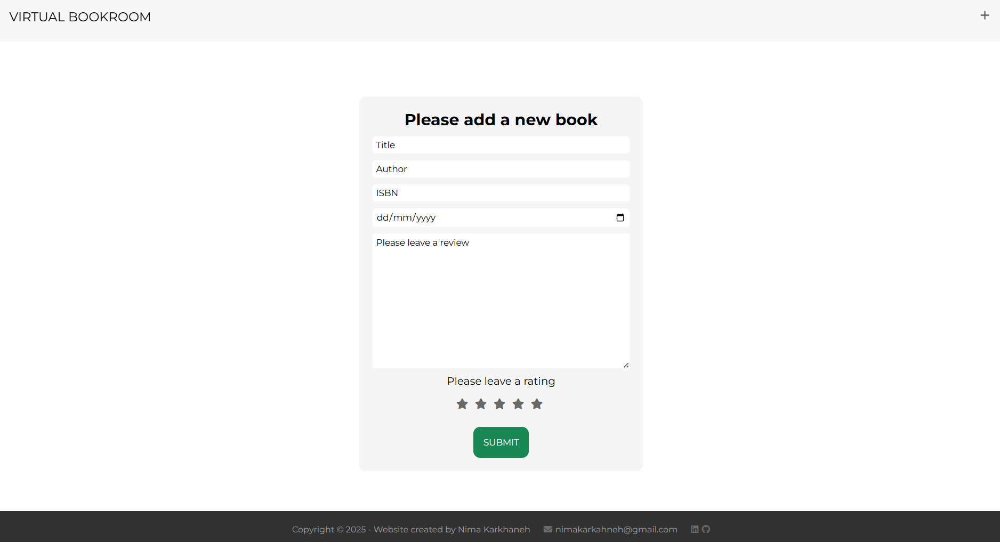
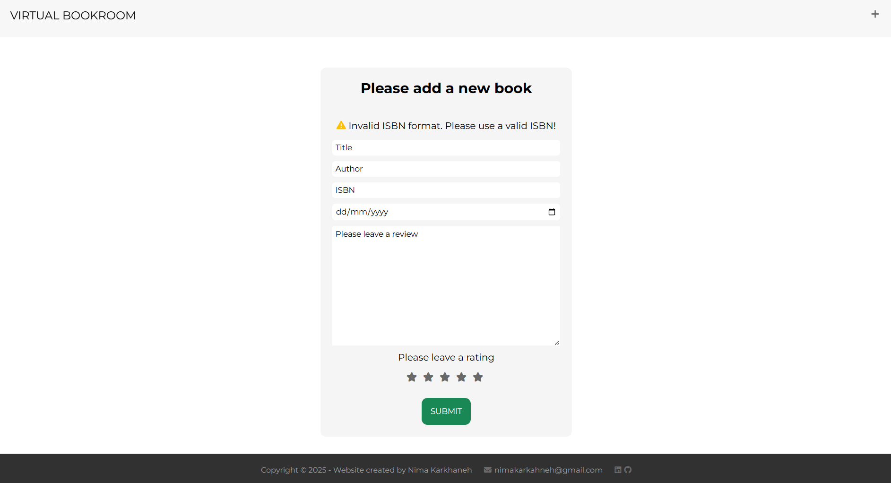

# Virtual Bookroom (Book Notes Project)

## Overview
**Virtual Bookroom** is a full-stack web application that allows users to create and manage their collection of book reviews. Users can add books with details such as title, author, ISBN, review, star rating, and the date they read the book. Book cover images are fetched dynamically from the Open Library API to enrich the experience. While the app does not implement user authentication, it captures the reader’s name with each review to provide basic identification. The library supports sorting by date, rating, or alphabetically for easy browsing.

## Table of Contents
- [Overview](#overview)
- [Screenshots](#screenshots)
- [Features](#features)
- [Technologies Used](#technologies-used)
- [Dependencies](#dependencies)
- [Challenges and Solutions](#challenges-and-solutions)
- [Installation Guide](#installation-guide)
- [Credit](#credit)


## Screenshots
<p align="center">
  
</p>
<p align="center"><em>Virtual Bookroom home page.</em></p>
<p align="center">
  
</p>
<p align="center"><em>View when book reviews are added.</em></p>
<p align="center">
  
</p>
<p align="center"><em>Virtual Bookroom add page.</em></p>
<p align="center">
  
</p>
<p align="center"><em>Invalid ISBN error.</em></p>

## Features
* **Add Book & Reviews:** Users can add books along with detailed reviews, star ratings, and reading dates. The name of the reader also appears after each review submission to allow for identifiable readers.
* **Edit and Delete:** Users can modify or remove their reviews anytime.
* **Dynamic Book Covers:** Book cover images are retrieved from the **Open Library API** based on ISBN.
* **Sorting:** Content can be sorted by review date, star rating, or book title alphabetically for improved navigation.
* **Responsive Design:** The interface adapts to different screen sizes for a smooth user experience.

## Technologies Used
### Frontend
* **Embedded JavaScript (EJS):** To structure the content of the website and add some functionality
* **Cascading Style Sheets (CSS):** To style the content of the website including a responsive design
* **JavaScript:** To add extra functionality to the website
### Backend
* **Node.js**: To run JavaScript on the server-side of the application
### Database
* **PostgresSQL**: To create a database for the web application
### APIs
* **Open Library API**: To access book covers

## Dependencies
* **dotenv**: To store sensitive information like the database credentials or API keys
* **express**: To build server-side of the application
* **ejs**: To enable Embedded JavaScript templates
* **pg**: To interact with the PostgresSQL from the backend

## Challenges and Solutions

### 1. Separating Data for Reviews and Ratings
**Challenge:**  
Displaying interactive star ratings while preserving clean data separation was difficult using a single table. Directly inserting review data (often containing quotes and line breaks) into JavaScript via EJS risked breaking scripts. Apart from this, you it is not possible to manipulate the DOM elements using EJS.

**Solution:**  
I created two separate tables:  
* **Library:** stores book details like title, author, ISBN, date read, review and name of the reader.  
* **Rating:** stores the numerical star rating for each book.

 This allowed review text to be rendered cleanly in EJS, while star ratings were handled via JavaScript using a safely serialized dataset
```javascript
const ratingData = JSON.parse('<%- JSON.stringify( starDisplay )%>');
ratingData.forEach((d)=>{
    const id = d.id;
    const rate = d.rate;
    const stars = document.querySelectorAll(`.star${id}`);
    if (stars != null)
    for (let i = 0; i < rate; i++){
        stars[i].style.color = "#dabd18b2"
    }
})
```
**Note:** `starDisplay` is declared and assigned with rating data in the backend and passed to the EJS render.
### 2. Displaying Readable Dates in Templates
**Challenge:**  
The database stored dates in YYYY-MM-DD format, but a more readable DD-MM-YYYY format was preferred for the frontend.

**Solution:**  
I formatted dates inside the EJS template using the JavaScript `Date` object and `padStart` to ensure consistency:
```ejs
    <% booksArr.forEach((book) => {
        const date = new Date(book.date);
        const day = String(date.getDate()).padStart(2, '0');
        const month = String(date.getMonth() + 1).padStart(2, '0');
        const year = date.getFullYear();
        const formattedDate = `${day}-${month}-${year}`;
    %>
    <p class="date-read">DATE READ: <%= formattedDate %></p>
```
### 3. Optimising Sorting and Page Rendering
**Challenge:**  
Implementing sorting on the backend and ensuring that the frontend reflects sorting data without redundant queries or rendering issues.

**Solution:**  
I introduced a `sortFunctionality` boolean flag. If sorting was triggered, the app reused the cached sorted data. Otherwise, it fetched fresh data from the database:
```javascript
let sortFunctionality = false;
app.get("/books", async (req,res)=>{
    if (!sortFunctionality) {
        try{
            const books = await db.query("SELECT * FROM library ORDER BY id ASC");
            const rating = await db.query("SELECT * FROM rating")
            if (books.rows == 0) {
               return res.render("index.ejs", {
                   error: "You don't have any books in your library. Please use the + icon on the top right to add your books!"
               })
            }
            booksArr = books.rows;
            starDisplay = rating.rows
            res.render("books.ejs",{
                booksArr: booksArr,
                starDisplay: starDisplay
            })
        }
        catch(err){
            console.log(err.message)
        }
    } else {
        res.render("books.ejs",{
            booksArr: booksArr,
            starDisplay: starDisplay
        })
        sortFunctionality = false;
    }
})
```
### 4. Validating ISBN Format and Checksums on the Backend
* **Challenge:**  
Ensuring only valid ISBN-10 or ISBN-13 codes get saved.
* **Solution:**  
I implemented a middleware to validate ISBN formats and checksums before database insertion:
```javascript
const isbn10Regex = /^\d{9}(\d|X)$/; // ISBN-10 format regex
const isbn13Regex = /^\d{13}$/;     // ISBN-13 format regex

function validateISBN(req, res, next) {
    const { ISBN } = req.body;

    // Clean input (remove non-numeric characters except 'X' in ISBN-10)
    const cleanedISBN = ISBN.replace(/[^0-9X]/gi, '').toUpperCase();

    // Check if the ISBN matches the format for ISBN-10 or ISBN-13
    if (isbn10Regex.test(cleanedISBN)) {
        if (isValidISBN10(cleanedISBN)) {
            return next(); // Valid ISBN-10, proceed to the next middleware/handler
        } else {
            return res.status(400).render("add.ejs", {
                error: 'Invalid ISBN-10 checksum' });
        }
    } else if (isbn13Regex.test(cleanedISBN)) {
        if (isValidISBN13(cleanedISBN)) {
            return next(); // Valid ISBN-13, proceed to the next middleware/handler
        } else {
            return res.status(400).render("add.ejs", {
                error: 'Invalid ISBN-13 checksum' });
        }
    }

    return res.status(400).render("add.ejs",{
        error: 'Invalid ISBN format. Please use a valid ISBN!' }); // Invalid format
}
```
### 5. Editing and Deleting Books While Maintaining Consistent Data
**Challenge:**  
Syncing changes/deletions across library and rating tables.

**Solution:**  
On edit or delete actions, I ensured that both tables were updated based on the shared `id`:
```javascript
app.post("/books/edit/:bookID", async (req, res) =>{
    const foundStarRating = starDisplay.find((d)=> d.id === parseInt(req.params.bookID));
    const foundBook = booksArr.find((d)=> d.id === parseInt(req.params.bookID));
    try{
        await db.query("UPDATE rating SET rate = ($1) WHERE id = ($2)", [req.body.rate, foundStarRating.id]);
        await db.query("UPDATE library SET title = ($1), author = ($2), isbn = ($3), date = ($4), review = ($5) , rate = ($6) WHERE id = ($7)", [req.body.title, req.body.author, req.body.ISBN, req.body.date, req.body.review, req.body.rate, foundBook.id]);
        res.redirect("/books")
    }
    catch(err){
        console.log(err.message);
    }
})
```
### 6. Aligning Book Covers and Reviews with CSS Float and Width
**Challenge:**  
Making book covers and text reviews wrap nicely and responsively.

**Solution:**  
I used CSS float for the book cover image and adjusted the width and margins to ensure the review text wraps properly:
```css
.book-cover{
    float: left;
    width: 100px;
    margin-right: 30px;
}
```
### 7. Handling Star Rating Clicks for Interactive UI
**Challenge:**  
Allow users to click stars to set their rating visually on the frontend.

**Solution:**
I added an event listener to stars and toggle classes based on click positions:
```javascript
const stars = document.querySelectorAll(".star-ranking");
stars.forEach((star, index1) =>{
    star.addEventListener("click", ()=>{
        stars.forEach((star, index2)=>{
            index1 >= index2 ? star.classList.add("active") : star.classList.remove("active");
        })
    })
})
```
### 8. Coordinating Data from Multiple Tables
**Challenge:**  
Displaying book info and ratings together from two separate tables required careful data handling.

**Solution:**  
I queried both tables on page load and passed them separately into the EJS render:
```javascript
const books = await db.query("SELECT * FROM library ORDER BY id ASC");
const rating = await db.query("SELECT * FROM rating")
res.render("books.ejs",{
            booksgit Arr: books.rows,
            starDisplay: rating.rows
        })
```
### 9. Handling Empty Library Edge Case Gracefully
**Challenge:**  
Prevent error or blank pages when user tries to view the library with no books.

**Solution:**  
I checked if the query result was empty and rendered an error message:
```javascript
 const books = await db.query("SELECT * FROM library ORDER BY id ASC");
 if (books.rows == 0) {
               return res.render("index.ejs", {
                   error: "You don't have any books in your library. Please use the + icon on the top right to add your books!"
               })
```

## Installation Guide
### Book Notes Project
This project is located in the `Book Notes Project` directory of a larger repository called `Portfolio`. It requires a `.env` file and a PostgreSQL database to run.
To install and use the project, please follow these steps:
1. Clone the repository  
```bash
git clone https://github.com/nima-karkhaneh/Portfolio.git
cd "Book Notes Project"

```
2. Install dependencies
```bash
npm install
```
3. Launch **pgAdmin** and connect to your PostgreSQL server. Create a new database followed by creating the following two tables:
```
CREATE TABLE library (
id SERIAL PRIMARY KEY,
title VARCHAR(50),
author VARCHAR(50),
isbn BIGINT,
date CHAR(10),
review TEXT,
rate INT
);

CREATE TABLE rating (
id SERIAL PRIMARY KEY,
rate INT
);

```
**Note:** `library.rate` is deprecated and only used initially, but `rating.rate` is used for display logic.  

**Note:** Ensure that `rating.id` matches the corresponding `library.id` for accurate star rendering.

4. Create a `.env` file in the root of the project and replace the placeholders with your local PostgreSQL credentials. Here is an example for your `.env` file:
```
DB_USER="Your PostgreSQL username (usually postgress unless you specified another)"
DB_HOST="localhost"
DB_DATABASE="The name of your database (e.g., my_project_db)"
DB_PASSWORD="Your PostgreSQL password"
DB_PORT="5432"
PORT="3000"

```
5. Run the application:  

`node index.js `  

6. Visit http://localhost:3000 in your browser to start the application
## Credit
This project was developed independently as a capstone assignment for **The Complete Full-Stack Web Development Bootcamp** by **Angela Yu (The App Brewery)**. While inspired by course objectives, all implementation decisions, styling, and additional features (like error handling and UI improvements) were completed by myself.

