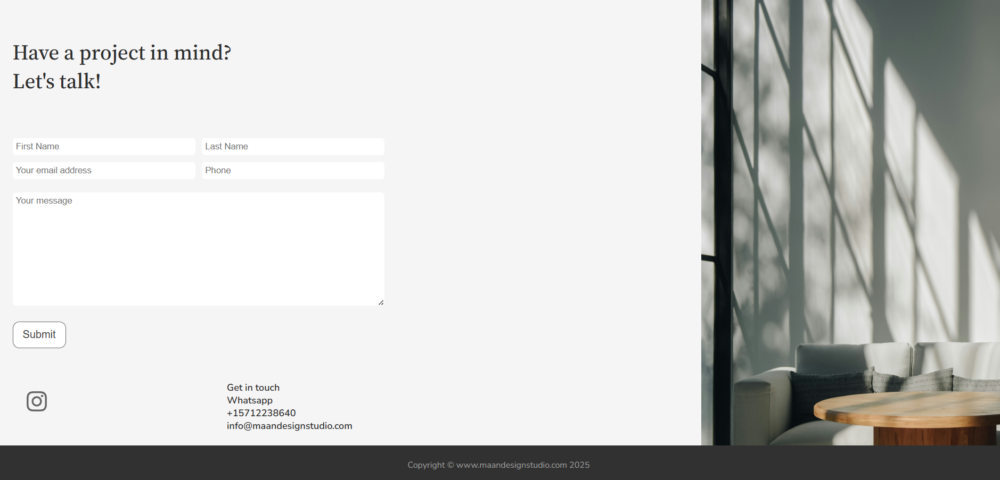

# Maan Design Studio - An Architectural Startup

## Overview
**Maan Design Studio** is a modern, responsive web application built for an architectural startup. The site showcases the founder’s expertise, available services, and a portfolio of past projects. It features a clean layout, intuitive navigation, and a fully functional contact form that sends messages directly via email. Designed with UI/UX best practices in mind, this project demonstrates a complete frontend and backend integration tailored to a professional design business.

---

## Features
- Responsive design that adapts seamlessly across desktop, tablet, and mobile devices
- Contact form with backend email functionality powered by Nodemailer
- Dynamic portfolio gallery displayed using Bootstrap carousel
- Animated text and interactive hamburger menu for enhanced user experience
- Automatic updating footer year via JavaScript
- Page loading spinner and form submission loader for smooth UX feedback
- Secure handling of sensitive credentials through environment variables
- Optimised images and logo scaling for consistent and professional appearance

---

## Screenshots

<p align="center">
  
</p>
<p align="center"><em>Home page showcasing the startup introduction.</em></p>

<p align="center">
  
</p>
<p align="center"><em>Portfolio page.</em></p>

<p align="center">
  
</p>
<p align="center"><em>Portfolio carousel.</em></p>

<p align="center">
  
</p>
<p align="center"><em>Contact form section with validation and submission feedback.</em></p>

---

## Technologies Used
### Frontend
* **HTML:** To structure the content of the website
* **CSS:** To style the content of the website including a responsive design
* **Bootstrap:** To add specific styles and extra functionality to the website
* **JavaScript:** To add functionality to the website

### Backend
* **NodeJS:** To run JavaScript on the server-side of the application

## Dependencies Used
* **dotenv:** To store sensitive information like nodemailer's username and password securely
* **express:** To create a web server on the backend of the application
* **nodemailer:** To handle the contact section of the application
* **serve-faviocn:** To serve the favicon for the application

## Challenges and Solutions
Throughout the development of this architectural startup website, several challenges arose that required thoughtful solutions to ensure a responsive, user friendly, and visually appealing experience. Below is a summary of key technical and design challenges and how they were addressed:

* **Responsive Design with Flexbox and Media Queries**  
  Implemented responsive layouts using Flexbox and media queries. For larger screens used `flex-direction: row`, while smaller screens switched to `flex-direction: column`, improving usability across devices.

* **Image Overflow Control**  
  Resolved layout issues by using `max-width: 30%` instead of `width: 30%`, ensuring images remained within their parent container without overflowing, regardless of screen size.

* **Animated Text Entrance for Enhanced UX**  
  Used CSS animations with a delay to animate text sliding in from off-screen, creating a more engaging and dynamic visual experience.

* **Client Portfolio Display with Bootstrap Carousel**  
  Utilised Bootstrap's built-in carousel component to showcase client portfolio images in a sleek, swipeable gallery.

* **Fly-out Hamburger Menu with JavaScript**  
  Built a custom responsive hamburger menu using vanilla JavaScript, enhance navigation on mobile and smaller screens with smooth open/close animations.

* **Dynamic Footer Year with JavaScript**  
  Used JavaScript to automatically generate and update the current year in the site footer, eliminating the need for manual edits in future years.

* **Page Loader Spinner for Improved UX**  
  Created a custom loading spinner using vanilla JavaScript to display before each page loads, enhancing perceived performance and user engagement.

* **Form Submit Loader for UX Feedback**  
  Added a loader spinner to the contact form's submit button using vanilla JavaScript, providing visual feedback during the form submission process.

* **Backend Form Handling with Nodemailer**  
  Used the Nodemailer npm package to handle contact form submissions and send emails reliably from the backend.

* **Error Handling for Form Submission**  
  Implemented robust error handling on form submission. The backend returns a success or error page depending on the result, ensuring users are properly informed.

* **Logo Scaling With Inkscape For Header Integration**  
  Used Inkscapte to resize and optimise the client-provided logo, ensuring it fits seamlessly within the website header while maintaining a visual quality.

* **Image Standardisation**  
  Ensured consistent image dimensions across the site to prevent distortion or blurring, especially during responsive scaling.

---

## Installation Guide
This project is located in the `Maan Design Studio` directory of a larger repository called `Portfolio`. You can add can a `.env` file to the root of the project if you wish to see how the `nodemailer` package works. Otherwise, the application should run on `port 3000`. To run the application, please follow the following steps;

1. Clone the repository:

```bash
git clone https://github.com/nima-karkhaneh/Portfolio.git
cd "Maan Design Studio - Architectural Startup"

```

2. Install the dependencies:

```bash
npm install
```

3. (optional) Create a `.env` in the root of the project and fill out the `nodemailer` placeholders with your own credentials. Here is an example of a `.env` file:

```
NODEMAILER_SERVICE="An email service you are using e.g. gmail"
CLIENT_EMAIL="The email in which the body of the contact form will be sent to"
NODEMAILER_USER="Your own email e.g. your gmail email"
NODEMAILER_PASS="Your nodemailer password. If you are using gmail this is called the app password and can be obtained by gmail after your have turned on the two factor authentication and provided the relevant information"
port="3000"
```

4. Run the application:

```bash
node index.js
```

5. Visit http://localhost:3000 in your browser to start the application.

---

## Credit
This project was developed independently by **Nima Karkhaneh** as part of a professional portfolio demonstrating frontend and backend web development skills.
