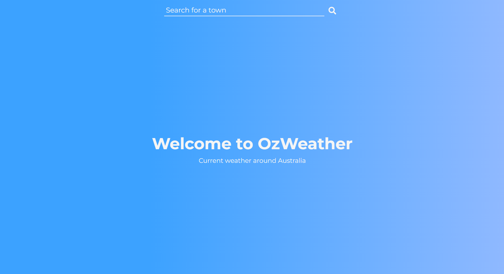
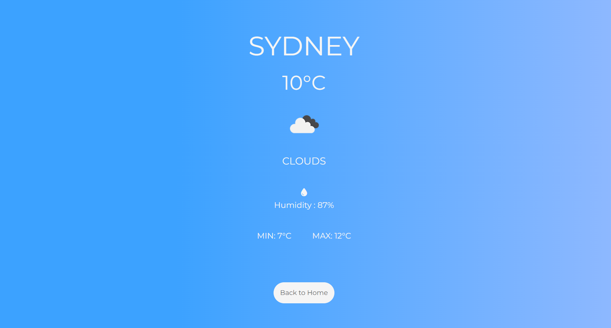
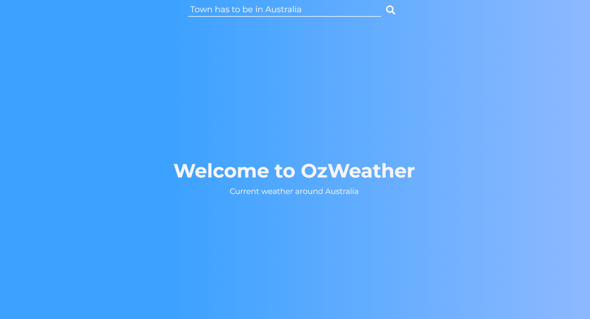

# OzWeather - Current Weather Around Australia

## Overview
**OzWeather** is a weather application that provides users with current weather information — including temperature, highs/lows, and humidity — for cities and towns within **Australia**.

## Screenshots

<p align="center">
  
</p>
<p align="center"><em>Home page.</em></p>

<p align="center">
  
</p>
<p align="center"><em>Example displaying weather data.</em></p>

<p align="center">
  
</p>
<p align="center"><em>Example displaying an error message.</em></p>

## Technologies Used

### Frontend
* **Embedded JavaScript (EJS):** To structure the content of the website and add some functionality
* **Cascading Style Sheets (CSS):** To style the content of the website including a responsive design

### Backend
* **Node.js**: To run JavaScript on the server-side of the application

## Dependencies
* **axios:** To make `htttp` requests to OpenWeatherMap API
* **dotenv:** To store the sensitive information such as the API key securely
* **express:** To build server-side of the application
* **ejs:**  To enable Embedded JavasScript

## Challenges and Solutions

### 1. Ensuring Accurate City Searches
**Challenge:**  
Some cities share the same name globally, leading to incorrect weather data.

**Solution:**  
Implemented a country code filter in the API request (`AU`for Australia) to ensure results are restricted to Australian locations only.

### 2. Displaying API Data on the Frontend  
**Challenge:**  
Passing the retrieved data to the frontend without using a frontend framework.

**Solution:**  
Used EJS to inject data into HTML templates. This allowed rendering weather details on the server before sending them to the client.

### 3. Form Visiblity Logic After Submission  
**Challenge:**  
After displaying the weather data, the form input should disappear for a better UI/UX.

**Solution:**  
Added conditional logic in the EJS form element to apply a `.invislbe` class.  
```ejs
<form action="/submit" method="post"
<% if (locals.city) { %>
class="invisible"
<% } %>>
    <input type="text" name="city" placeholder="Search for a town" autocomplete="off" required>
    <button class="search-btn" type="submit"></button>
</form>
```

### 4. Handling Invalid or Misspelled City Names
**Challenge:**  
API requests failed when users entered invalid or misspelled city names, crashing the app or showing no feedback.

**Solution:**  
Wrapped API calls in `try/catch`blocks and added logic to show a user-friendly error message on the frontend if the city is not found.
```javascript
<script>
    // Adding the error message to the input placeholder
    const error = <%- JSON.stringify(locals.errMsg || "") %>
    if (error){
        document.querySelector("input").setAttribute("placeholder", error);
    }
</script>
```

### 5. Securing the API Key  
**Challenge:**  
Risk of exposing sensitive API credentials in the codebase.

**Solution:**  
Used `dotenv` to load environment variables from a `.env` file and ensured `.env` was included in `.gitignoe`.

### 6. Designing a Responsive UI Without a Framework
**Challenge:**  
Maintaining a clean and responsive design using only plain CSS.

**Solution:**  
Applied responsive design principles (like Flexbox) and media queries to ensure usability across devices.

## Installation Guide
This project is located in the `Weather application` directory of a larger repository called `portfolio`. It requires you to sign up to to the OpenWeatherMap API and obtain your own API key. You will also need a `.env` file to store your API key securely.
To sign up and obtain your API key, please visit the following website;  

https://openweathermap.org/api  

To install and use the project, please follow the following steps:
1. Clone the repository:
```bash
git clone https://github.com/nima-karkhaneh/portfolio.git
cd "Weather application"

```
2. Install the dependencies:  

`npm install`  

3. Create a `.env` file in the root directory of the project and replace the placeholders with your own API key. Here is an example of your `.env` file:
```
API_KEY="Your own API key"

```  
4. Run the application:

`node index.js`

5. Visit http://localhost:3000 in your browser to start the application

## Credit
This project was developed independently as a capstone assignment for **The Complete Full-Stack Web Development Bootcamp** by **Angela Yu (The App Brewery)**. While inspired by course objectives, all implementation decisions, styling, and additional features (like error handling and UI improvements) were completed by myself.

Supplementary concepts were also reinforced through external learning, including the YouTube tutorial:  
*“Asynchronous JavaScript Course – Async/Await, Promises, Callbacks, Fetch API”* by **CodeLab98**.
