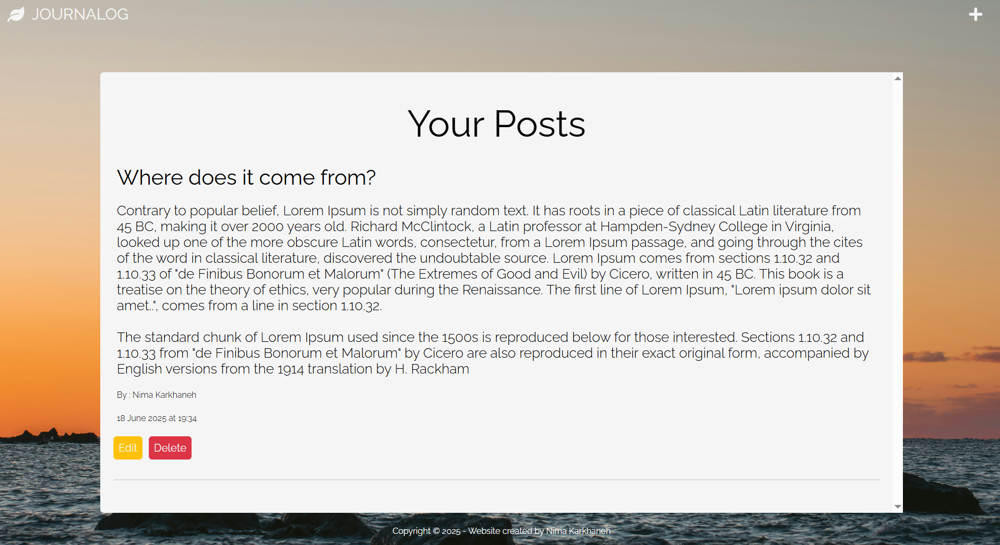

# Journalog – A Simple Blog Application

## Overview
**Journalog** is a web blog application that allows users to create, edit, and delete posts. Each post is timestamped and displayed in reverse chronological order (latest posts first). The app demonstrates clean backend routing, dynamic templating with EJS, and responsive frontend styling.

## Screenshots
<p align="center">
  
</p>
<p align="center"><em>Main posts page showing blog entries.</em></p>

<p align="center">
  
</p>
<p align="center"><em>View when no posts are created.</em></p>

<p align="center">
  
</p>
<p align="center"><em>Example of a post created with the line breaks preserved.</em></p>

---

## Features
- Create, edit, and delete posts
- Posts are timestamped and ordered newest-first
- Clean and responsive layout with partials (header & footer)
- Preserves line breaks from user input (multi-line post formatting)
- Intuitive interface for post editing and deletion

---

## Technologies Used

### Frontend
- **Embedded JavaScript (EJS):** For dynamic templating and rendering data on the frontend
- **CSS:** For styling and responsive design
- **Vanilla JavaScript:** To enhance interactivity

### Backend
- **Node.js:** JavaScript runtime for server-side logic

---

## Dependencies
- **express:** Web framework for handling routes and server logic
- **ejs:** Template engine for rendering HTML with embedded JavaScript
- **express-validator**: Middleware for validating and sanitising user input


---

## Challenges & Solutions

### 1. Simplifying Date Formatting  
**Challenge:**  
JavaScript’s default `Date()` output included verbose timezone info (e.g., `GMT+1000` and full timezone names), making the UI look cluttered.  

**Solution:**  
Formatted the date on the backend using `toLocaleDateString()` and `toLocaleTimeString()` with custom options to return a cleaner, user-friendly string like `"17 June 2025 at 20:47"`.

---

### 2. Implementing Post Editing with Prefilled Form Values  
**Challenge:**  
Allowing users to edit a post by pre-populating the form with the current post content.  

**Solution:**  
Used dynamic routing (`/edit/:postID`) to fetch the selected post by ID. Passed the data to the `edit-posts.ejs` template and prefilled the input fields using EJS. Unchanged fields were preserved during submission.

---

### 3. Deleting a Specific Post by ID  
**Challenge:**  
Enable reliable and efficient deletion of a single post using its unique identifier.  

**Solution:**  
Created a dynamic GET route (`/posts/delete/:postID`) to locate the post in the in-memory array and remove it using `splice()`, then redirected back to the updated posts view.

---

### 4. Reusing Header and Footer with Partials  
**Challenge:**  
Avoid code duplication and maintain consistency across multiple views.  

**Solution:**  
Abstracted the header and footer into partial EJS files (`partials/header.ejs` and `partials/footer.ejs`) and included them in all views using `<%- include("partials/header.ejs") %>` and `<%- include("partials/footer.ejs") %>`. This made the layout modular and easy to maintain.

---

### 5. Preserving Line Breaks in User-Submitted Posts
**Challenge:**  
When users wrote multi-line posts using a `<textarea>`, any line breaks (e.g. pressing Enter) were ignored when rendering the post on the page. This caused all the text to appear as one continuous block, making posts hard to read.

**Solution:**  
Applied the CSS rule `white-space: pre-line` to a reusable `.post-text` class. This property tells the browser to preserve newline characters while still allowing natural line wrapping. The class was then applied to all `<p>` elements displaying user-submitted post content:

```ejs
<p class="post-text"><%= post.text %></p>
```
```css
.post-text {
  white-space: pre-line;
}
```
---

## Recent Improvements

### Font Stack Refinement
**Problem:** Fonts appeared inconsistently, leading to a poor and unpredictable user experience.

**Solution:** Adopted a consistent font strategy across the app:
- Set `Roboto, sans-serif` globally for form inputs, paragraphs, and default body text.
- Used `Raleway` for headings and buttons to preserve design intent.
- Added fallbacks (`sans-serif`, `serif`) to ensure graceful degradation.

---

### Layout & Styling Consistency Across Pages
**Problem:** Typography and spacing varied between pages, creating an inconsistent look—especially when transitioning from homepage to form pages.

**Solution:**
- Replaced standalone `<h2>` tags with a single `<h1>` per page, using semantic HTML.
- Introduced utility classes like `.welcome-txt`, `.posts-page-title`, `.form-title` for consistent font size, weight, and spacing.
- Unified margins, paddings, and responsive breakpoints across all views using custom CSS and media queries.

---

### Enhanced Validation and Error Handling
**Problem:** Users received generic or no feedback on invalid form submissions. Status codes were also incorrectly assigned (e.g., using 400 instead of 404).

**Solution:**
- Added backend validation using `express-validator` for new and edited posts.
- Displayed error messages dynamically on the frontend using EJS and `.form-error` styling.
- Updated error middleware to return accurate HTTP status codes and cleaner responses.

---

### Smooth UX After Post Deletion
**Problem:** After deleting the last post, the app displayed a blank container or preserved query parameters (`?deleted=true`), which looked broken or confusing.

**Solution:**
- Implemented a conditional message (`.no-post-msg`) that fades in only when there are no posts.
- Cleared URL query parameters after deletion to avoid stale UI states.
- Polished spacing and transitions for visual clarity.

---

### Custom 404 Error Page
**Problem:** Visiting an unknown route rendered a plain, unstyled error or default Express message, disrupting the user experience.

**Solution:**
- Added a custom `/404` route with a visually styled EJS template.
- Centered content using Flexbox (`.content-404`) and applied readable, responsive typography (`.txt-404`).

---

### Refactored CSS for Maintainability
**Problem:** The stylesheet contained redundant vendor-specific rules (e.g., `appearance: none`, `-webkit-appearance`), which added noise and had minimal modern effect.

**Solution:**
- Reviewed cross-browser support and removed unnecessary rules after testing on Firefox, Chrome, and Safari.
- Centralised font declarations and reduced duplication (e.g., reusing `Raleway`, `Roboto` where needed).
- Organised styles logically by component: home page, forms, posts, error views, and media queries.

---

## Installation

This project is located in the `Blog web application` folder of a larger repository named `portfolio`.

To run it locally:

1. Clone the repository:
   ```bash
   git clone https://github.com/nima-karkhaneh/portfolio.git
   cd blog-web-application
   ```

2. Install dependencies:
   ```bash
   npm install
   ```

3. Run the application:
   ```bash
   node index.js
   ```

4. Open your browser and visit [http://localhost:3000](http://localhost:3000)

---

## Credit

This project was created as a **capstone project** for the *Complete Full-Stack Web Development Bootcamp* by **The App Brewery**, taught by **Dr. Angela Yu**.  
While the course provided foundational knowledge, all logic, structure, and implementation in this blog application were developed independently as part of the capstone challenge.
