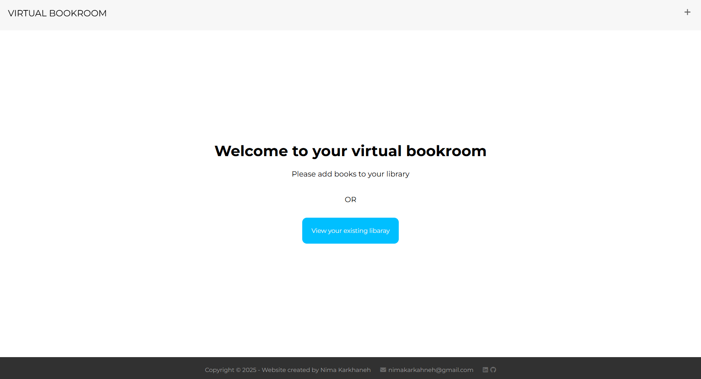
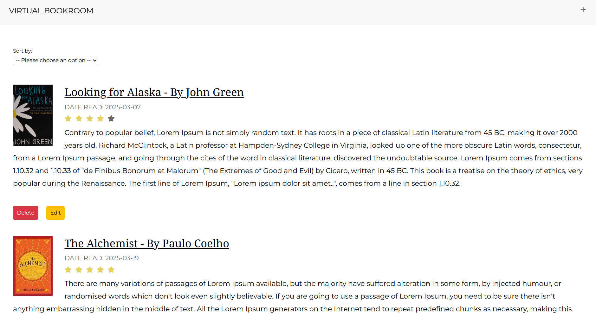
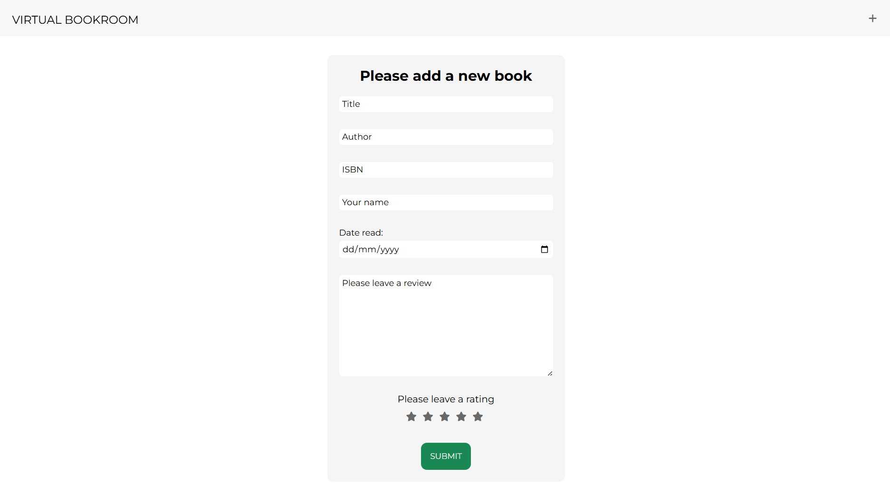
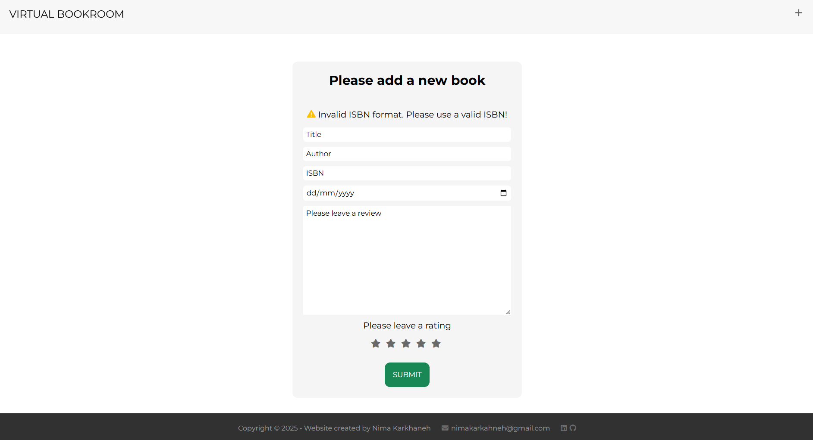

# Virtual Bookroom (Book Notes Project)

## Overview
**Virtual Bookroom** is a full-stack web application that allows users to build a virtual library and record reviews of their books.

The application has been **refactored into a RESTful architecture** with clear separation of concerns:

- **Client-facing Express app (`server.js`, runs on `localhost:3000`)**  
  Serves the UI (EJS templates, CSS, JS) to the browser.

  For all data operations, it calls the backend API using `axios`.

- **Backend API (`api.js`, runs on `localhost:4000`)**  
  Exposes RESTful JSON endpoints (`/books`, `/books/:id`). Handles all PostgreSQL queries, validation, and error handling.

- **Database (PostgreSQL)**  
  Two normalised tables:
    - `library` → book details (title, author, ISBN, review, date, reader name)
    - `rating` → star ratings, linked to `library` via foreign key

Book covers are fetched dynamically from the **Open Library API**, and users can sort by **date read**, **rating**, or **alphabetically**.

**Note:** The **Open Library API** returns a blank placeholder image if no cover is available.

---

## Table of Contents
- [Overview](#overview)
- [Screenshots](#screenshots)
- [Features](#features)
- [Architecture](#architecture)
- [Database Schema](#database-schema)
- [Technologies Used](#technologies-used)
- [Dependencies](#dependencies)
- [Challenges and Solutions](#challenges-and-solutions)
- [Installation Guide](#installation-guide)
- [API Endpoints](#api-endpoints)
- [Credit](#credit)

---


## Screenshots
<p align="center">
  
</p>
<p align="center"><em>Virtual Bookroom home page.</em></p>
<p align="center">
  
</p>
<p align="center"><em>View when book reviews are added.</em></p>
<p align="center">
  
</p>
<p align="center"><em>Virtual Bookroom add page.</em></p>
<p align="center">
  
</p>
<p align="center"><em>Invalid ISBN error.</em></p>

---

## Features
- Add book reviews with: title, author, ISBN, star rating, review text, reader’s name, and date read.
- Edit and delete reviews through API-powered forms.
- Dynamic book covers via the **Open Library API**.
- Sort library by **date read**, **rating**, or **title**.
- Responsive design.
- RESTful JSON API.

---

## Architecture

```
Frontend (EJS + static assets)
         |
Backend server.js (server.js @ localhost:3000)
         |
       axios/fetch
         ↓
Backend API (api.js @ localhost:4000)
         |
      PostgreSQL
```

- **server.js** → renders pages, handles form submissions, and calls the API.
- **api.js** → handles CRUD via RESTful endpoints and queries the PostgreSQL database.
- **PostgreSQL** → normalised schema with two tables (`library`, `rating`) and foreign key constraints.

---

## Database Schema

```sql
-- Table: library
\d library

   Column     |          Type          | Nullable | Default
--------------+------------------------+----------+-------------------------------------
 id           | integer                | not null | nextval('library_id_seq'::regclass)
 title        | character varying(50)  |          |
 author       | character varying(50)  |          |
 isbn         | bigint                 |          |
 date         | date                   |          |
 review       | text                   |          |
 reader_name  | character varying(255) |          |
Indexes:
    "library_pkey" PRIMARY KEY, btree (id)
Referenced by:
    TABLE "rating" CONSTRAINT "fk_library" FOREIGN KEY (library_id) REFERENCES library(id) ON DELETE CASCADE


-- Table: rating
\d rating

   Column     |  Type   | Nullable | Default
--------------+---------+----------+------------------------------------
 id           | integer | not null | nextval('rating_id_seq'::regclass)
 rate         | integer |          |
 library_id   | integer | not null |
Indexes:
    "rating_pkey" PRIMARY KEY, btree (id)
Foreign-key constraints:
    "fk_library" FOREIGN KEY (library_id) REFERENCES library(id) ON DELETE CASCADE
```

Key changes from original schema:
- `date` column in `library` is now **DATE** (not `CHARACTER(10)`).
- `rate` moved into separate `rating` table.
- `rating.library_id` → foreign key referencing `library.id`, with **ON DELETE CASCADE** for cleanup.

---

## Technologies Used
### Frontend
- **EJS**
- **CSS**
- **Vanilla JavaScript**

### Backend
- **Node.js + Express**
- **Axios**
- **PostgreSQL (pg)**

### APIs
- **Open Library API**

---

## Dependencies
- `express`
- `dotenv`
- `axios`
- `pg`
- `ejs`

---

## Challenges and Solutions

### Pre-Refactor Challenges (Original Version)

1. **ISBN Validation**
    - *Challenge*: Users could enter invalid or malformed ISBNs.
    - *Solution*: Added backend ISBN validation middleware with checksum logic.

2. **Star Ratings**
    - *Challenge*: Displaying dynamic star ratings without breaking alignment.
    - *Solution*: Stored ratings in a dedicated `rating` table and rendered stars dynamically in EJS.

3. **Empty Library Page**
    - *Challenge*: Empty state looked broken if no books were stored.
    - *Solution*: Displayed a fallback message encouraging users to add their first book.

4. **CSS Wrapping for Long Text**
    - *Challenge*: Reviews and titles overflowed containers.
    - *Solution*: Applied `word-wrap: break-word;` and flexbox fixes.

---

### Post-Refactor Challenges (RESTful API Upgrade)

1. **Refactoring to RESTful Design**
    - *Challenge*: Original app mixed DB queries with frontend routes.
    - *Solution*: Split into `server.js` (frontend) and `api.js` (backend API).

2. **Sorting by Date, Rating, Title**
    - *Challenge*: Sorting had to be reliable and efficient.
    - *Solution*: Implemented SQL `ORDER BY` with query params (`?sort=date`, `?sort=rating`, `?sort=alphabet`).

3. **Error Handling**
    - *Challenge*: Crashes on invalid routes or failed DB queries.
    - *Solution*: Added structured error handling and catch-all middleware returning JSON:
      ```js
      app.use((req, res) => {
        res.status(404).json({ error: "Route not found" });
      });
      ```  

4. **Editing & Deleting Books**
    - *Challenge*: In the original version, all updates and deletions were handled with just `GET` and `POST` requests. For example, deleting a book via a GET route is both insecure and not in line with RESTful principles. This limitation wasn’t covered in depth in the course materials
    - *Solution*: Added proper REST methods (`PATCH`, `DELETE`) with cascading deletes via FK.

---

## Installation Guide

1. Clone the repository:
```bash
git clone https://github.com/nima-karkhaneh/portfolio.git
cd book-notes-project

```

2. Install dependencies:
```bash
npm install
```

3. Setup PostgreSQL:  

    **Step 1: Access PostgreSQL**  
    Open your terminal and run:

    ```bash
    psql -U <your_postgres_username>
    ```
   *Alternative:* If your terminal is not configured for PostgreSQL, you can launch PgAdmin (the official PostgreSQL GUI) to create a database and run the commands.

    **Step 2: Create Database**  
    ```sql
    CREATE DATABASE virtual_bookroom;
    \c virtual_bookroom;

    ```
   *Note:* You can replace `virtual_bookroom` with any database name you prefer.

    **Step 3: Create Tables**  

    **Library Table**
    ```sql
   CREATE TABLE library (
    id SERIAL PRIMARY KEY,
    title VARCHAR(50),
    author VARCHAR(50),
    isbn BIGINT,
    date DATE,
    review TEXT,
    reader_name VARCHAR(255)
    );
   ```
   **Rating Table** 
    ```
   CREATE TABLE rating (
    id SERIAL PRIMARY KEY,
    rate INT,
    library_id INT NOT NULL,
    CONSTRAINT fk_library FOREIGN KEY (library_id) REFERENCES library(id) ON DELETE CASCADE
    );
    ```
   *Note:* The `rating` table uses a foreign key to link each rating to a book in the `library` table. Deleting a book automatically deletes its ratings.  

    **Step 4: Verify Tables**
    ```sql
   \d library
    \d rating
    ```
   You should see columns, types, and the foreign key relationship correctly listed.


4. Create a `.env` file in the root of the project and replace the placeholders with your local PostgreSQL credentials. Here is an example for your `.env` file:
```dotenv
DB_USER="Your PostgreSQL username (usually postgress unless you specified another)"
DB_HOST="localhost"
DB_DATABASE="The name of your database (e.g., my_project_db)"
DB_PASSWORD="Your PostgreSQL password"
DB_PORT="5432"
API_BASE_URL="http://localhost:4000"
```

5. Run servers:  
To start the app locally:
   ```bash
   # frontend
   npm run dev:server

   # backend
   npm run dev:api
   ```
   *Note:* Keep both servers running in separate terminal windows/tabs. The frontend runs on `localhost:3000` and calls the backend API on `localhost:4000`.

---

## API Endpoints

### `GET /books`
Fetch all books. Supports sorting:
- `?sort=date`
- `?sort=rating`
- `?sort=alphabet`

### `GET /books/:id`
Fetch a single book by ID.

### `POST /books`
Add a new book (and optional rating).

### `PATCH /books/:id`
Edit a book.

### `DELETE /books/:id`
Delete a book (cascades to ratings).

---

## Planned Improvements

- **Full Input Validation**
   - *Current*: ISBNs are validated with custom logic to prevent malformed entries.
   - *Next Step*: Integrate [`express-validator`](https://express-validator.github.io/docs/) to validate all form inputs (title, author, review, rating, date, reader name) server-side. This will enhance security, prevent bad data, and make the app more robust.
 ---

## Credit
- This project was developed independently as a **capstone project** for *The Complete Full-Stack Web Development Bootcamp* by **Angela Yu (The App Brewery)**. Unlike the guided tutorial projects (such as the blog app), the capstone had **no starter or solution code** — all design, database schema, REST API implementation, error handling, and UI development were completed entirely by me. The course provided the broad learning foundation, but the **Virtual Bookroom** is my own original implementation.  


- [Open Library API](https://openlibrary.org/dev/docs/api/books) for book cover data.

