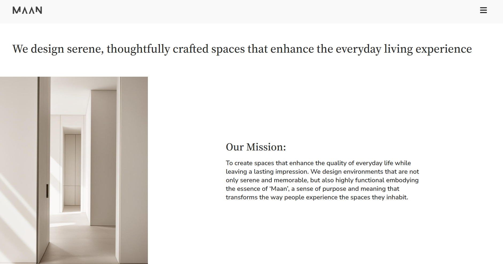
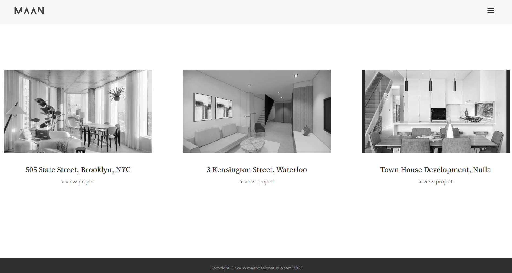
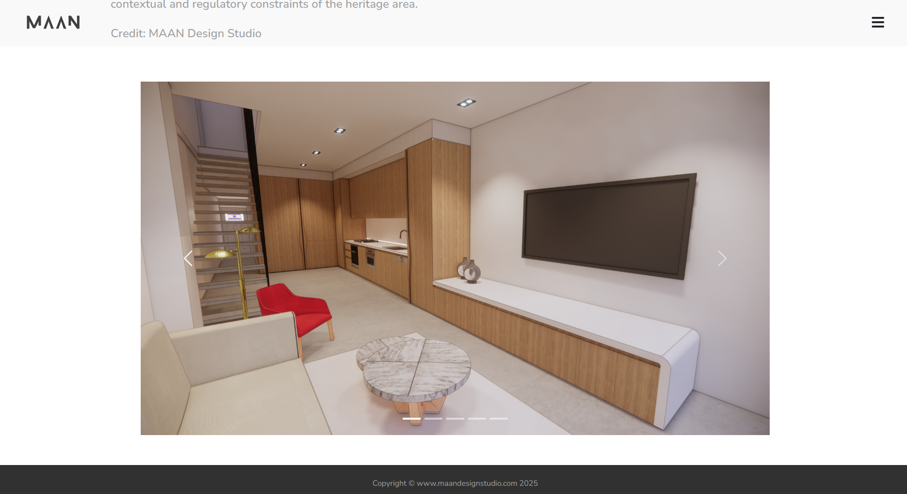
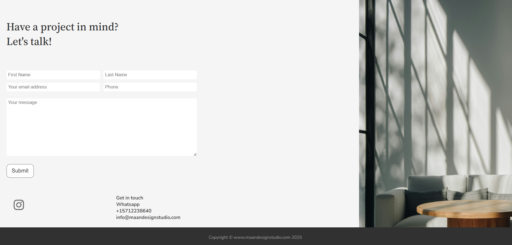

# Maan Design Studio - Architectural Startup Website

## Overview
**Maan Design Studio** is a modern, full-stack web application designed for an architectural startup. It showcases the founder’s philosophy, service offerings, and past projects in a clean and responsive layout. The app includes a fully functional contact form powered by Nodemailer and integrates frontend and backend validation with session-based protection for sensitive routes.

This project demonstrates UI/UX design, backend integration, session management, and user feedback through dynamic toast messages — all built using vanilla technologies and Node.js.

---

## Table of Contents
- [Overview](#overview)
- [Features](#features)
- [Technologies Used](#technologies-used)
- [Implementation Notes](#implementation-notes)
- [Screenshots](#screenshots)
- [Challenges & Solutions](#challenges--solutions)
- [Additional Technical Notes](#additional-technical-notes)
- [Installation & Setup](#installation--setup)
- [Development Workflow](#development-workflow)
- [Performance & Optimisation](#performance--optimisation)
- [Author](#author)
- [License](#license)


---

## Features

-  **Fully responsive** layout for mobile, tablet, and desktop
- **Contact form** with input validation, sanitization, and email delivery
- **Dynamic toast notifications** for real-time form feedback
- **Protected success/error routes** using `express-session`
- **Custom 403 Forbidden logic** to prevent URL access after form submission
- **Page and button loaders** for smooth UX
- **Accessible hamburger menu** with fly-out animation
- **Automatic year update** in footer
- **Optimised assets** including scalable vector logos and standardised image sizes

---

## Technologies Used

### Frontend
- **HTML5 & CSS3**
- **Vanilla JavaScript**
- **Bootstrap (for portfolio carousel)**
- **Fetch API** (replacing EJS-based form handling)

### Backend
- **Node.js**
- **Express.js**
- **Nodemailer**
- **express-validator**
- **express-session**
- **dotenv**
- **serve-favicon**

---

## Implementation Notes

This project originally used **EJS** to render the main contact form and handle validation errors by re-rendering the entire page. However, this created UX issues: the form would scroll out of view and reset, making toast messages less useful.

To fix this, the project now uses **vanilla HTML** and handles form submission with the **Fetch API**, allowing real-time inline feedback (toast messages) without reloading the entire page. This refactor dramatically improves user experience.

---

## Screenshots

<p align="center">
  
</p>
<p align="center"><em>Home page showcasing the startup introduction.</em></p>

<p align="center">
  
</p>
<p align="center"><em>Portfolio page.</em></p>

<p align="center">
  
</p>
<p align="center"><em>Bootstrap-powered image carousel.</em></p>

<p align="center">
  
</p>
<p align="center"><em>Contact form with error messages and loaders.</em></p>


---

## Challenges & Solutions

| Challenge | Solution |
|----------|----------|
| Page reloads on validation errors caused poor UX | Switched to Fetch API with dynamic toasts |
| Manually typed `/success` or `/unsuccess` URLs bypassed logic | Added session-based route protection |
| Spinner stayed active after failed submission | Implemented timeout + reset logic |
| Phone input accepted any string | Added regex validation on both frontend and backend |
| Favicon wasn’t loading in all browsers | Added `serve-favicon` middleware |
| Logo didn't scale well on small screens | Resized with Inkscape and used SVG format |
| Footer year needed manual update | Automated using JavaScript |

---

## Additional Technical Notes

- **Responsive Design with Flexbox and Media Queries**: Used `flex-direction: row` for wide screens, and `column` for smaller screens to maintain layout integrity.
- **Image Overflow Control**: Used `max-width` instead of `width` to ensure images stayed within bounds.
- **Animated Text Entrance**: Added delayed slide-in animations for enhanced UX.
- **Fly-out Hamburger Menu**: Implemented using vanilla JS for smooth mobile navigation.
- **Form Submit Loader**: Spinner added to the submit button to give users real-time feedback.
- **Image Standardisation**: Ensured image consistency across portfolio cards and carousel items.

---

## Installation & Setup

1. **Clone the repo**

```bash
git clone https://github.com/nima-karkhaneh/portfolio.git
cd maan-design-studio-architectural-startup
```
2. **Install dependencies**  

`npm install`

3. **(Optional) Add a .env file**  

  ```dotenv 
  NODEMAILER_SERVICE="gmail"
  CLIENT_EMAIL="recipient@email.com"
  NODEMAILER_USER="your@email.com"
  NODEMAILER_PASS="yourAppPassword"
  SESSION_SECRET="yourRandomSessionSecret"
  ```
**Note**: Use Random.org or another secure generator for your session secret. Gmail requires 2FA to generate app passwords.

4. **Start the server**  

`node index.js`

5. **View in browser**  
Visit `http://localhost:3000`

---

## Development Workflow

- Feature branches are created for new features or fixes with descriptive names (e.g. `maandesign/backend-validation-sanitisation`)
- Commits are meaningful and granular.
- Branches are pushed to remote and merged via Pull Requests.
- Code reviews and testing are done before merging to `main`.
- After merging, `main` is kept up to date locally with `git pull`
- Rebase is used for cleaning up commit history before merging when needed
___

## Performance & Optimisation

- Avoided including the full Font Awesome library to reduce unnecessary bloat.
- Extracted only the required SVG icons and created an optimised SVG sprite in Inkscape instead.
- This approach significantly reduces page load size and improves rendering performance.
- Leveraged Bootstrap CDN for core styling to minimise redundant dependencies.

___

## Author
This project was built by **Nima Karkhaneh** as part of a professional portfolio to demonstrate frontend and backend proficiency in real-world applications.

---

## License

This project is licensed under a customised [MIT License](./LICENSE).

You are free to clone and explore the code for educational or personal use.  
Attribution is required. Commercial use or redistribution without permission is not allowed.  
Pull requests and contributions are welcome.


