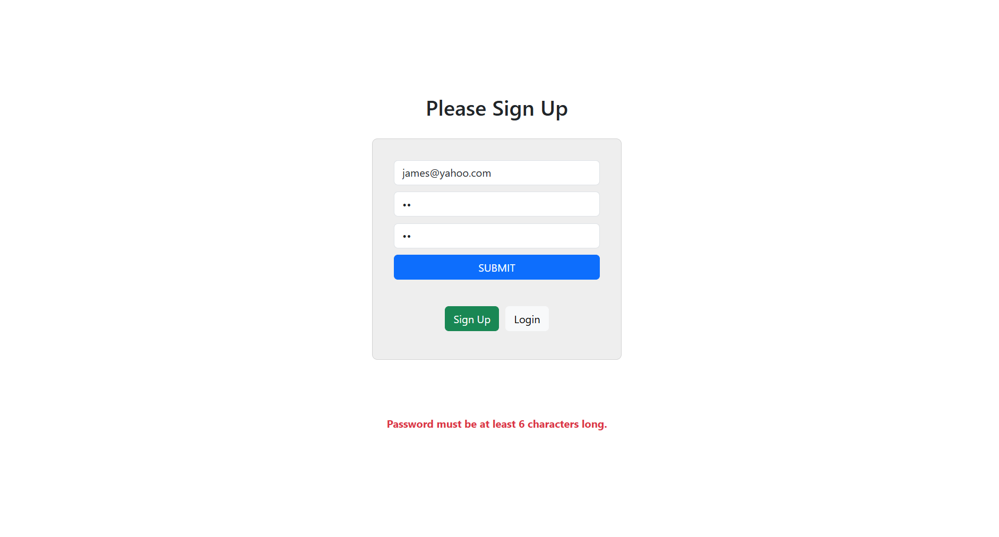

# Secure ToDo List Application

## Overview
This project is a **production-grade, full-stack ToDo List application** built with the PERN stack (PostgreSQL, Express, React, Node.js). Unlike a typical tutorial todo app, it focuses on **real-world security and deployment challenges**:

- Authentication is handled using **JWTs stored in secure, `httpOnly` cookies**, protecting against XSS.
- Backend routes are protected by **authorisation middleware** that verifies tokens and user IDs.
- All input is **validated and sanitised** before reaching the database, preventing SQL injection and malicious payloads.
- Database connections are managed through **connection pooling** (`pg.Pool`) for stability in production (deployed with Neon).

The frontend is a **responsive SPA** built with React and React Router, providing smooth navigation between login, signup, and dashboard pages without full reloads.

> **Note:** Since the backend is hosted on Render (with a free-tier PostgreSQL instance on Neon), the API may experience cold starts of several seconds. This can also be true for the frontend which is hosted on Vercel.

## Table of Contents
- [Overview](#overview)
- [Live Demo](#live-demo)
- [Screenshots](#screenshots)
- [Features](#features)
- [Technologies Used](#technologies-used) 
- [Dependencies](#dependencies)
- [Challenges and Solutions](#challenges-and-solutions)
- [Deployment Challenges and Solutions](#deployment-challenges-and-solutions)
- [Installation Guide](#installation-guide)
- [Development Workflow](#development-workflow)
- [Planned Improvements](#planned-improvements)
- [Final Note](#final-note)
- [Credit](#credit)

## Live Demo
**Access the deployed application here:**

[https://todo-list-snowy-alpha-10.vercel.app/auth](https://todo-list-snowy-alpha-10.vercel.app/auth)

> **Note:** The app may take 10–20 seconds to load initially due to cold starts on the serverless backend (typical for free-tier deployments). Subsequent requests will be faster.


## Screenshots
<p align="center">
  
</p>
<p align="center"><em>Home page featuring user authentication</em></p>

<p align="center">
  
</p>
<p align="center"><em>Success message when a new user signs up</em></p>

<p align="center">
  
</p>
<p align="center"><em>Sign up error message when user submits empty fields</em></p>

<p align="center">
  
</p>
<p align="center"><em>Password length error when user inputs a short password</em></p>

<p align="center">
  
</p>
<p align="center"><em>Example of ToDo items</em></p>

## Features
- **Secure Authentication:** Login generates a JWT stored in a secure, `httpOnly` cookie.
- **Input Validation:** All user input (signup, login, todos) is validated and sanitised to block malicious data.
- **User-Specific Data:** Each todo is linked to the authenticated user, ensuring data isolation.
- **CRUD Functionality:** Users can create, edit, and delete todos with instant UI updates.
- **Protected Routes:** Protected routes ensure only logged-in users can access the dashboard.

## Technologies Used
### Frontend
* **ReactJS:** Component-based JavaScript library for building the user interface
* **React Router:** Enables client-side routing and SPA behavior
* **Bootstrap:** CSS framework for responsive and mobile-first design
### Backend
* **Node.js**: To run JavaScript on the server-side of the application
### Database
* **PostgreSQL**: To create a database for the web application

## Dependencies
### Frontend
The directory structure of the client side of the application has been created using Vite. The full list of dependencies are as follows;
* **react:** Created by Vite to enable writing a React application 
* **react-dom:** Created by Vite to enable writing a React application
* **react-router-dom:** To enable navigation and routing in React apps without reloading the page.
* **axios:** To enable frontend to make http requests to the backend API of the application
### Backend
* **bcrypt:** To hash the passwords before storing them in a database
* **cookie-parser:** To access the JSON Web Token stored in a cookie
* **cors:** To enable the frontend Vite server to communicate with the backend API
* **dotenv:** To securely store sensitive information like the database credentials or API keys
* **express:** To create a backend API
* **jsonwebtoken:** To generate a JSON Web Token for user authentication/authorisation
* **pg:** To interact with the PostgreSQL from the backend

## Challenges and Solutions
## Backend

### Securely Storing JWT Without Exposing It to Frontend JS

**Challenge:**  
Avoid storing JWT tokens in localStorage or accessible client-side storage to prevent XSS attacks.

**Solution:**
- Store JWT as an `httpOnly` cookie so it’s inaccessible to frontend JavaScript but sent automatically with requests.
- Use backend middleware to decode the token from the cookie and authorise requests.

### Managing Cross-Origin Cookies and CORS Configuration

**Challenge:**  
Enable secure cookies to be sent between frontend (`localhost:5173`) and backend (`localhost:3000`) during development.  

**Solution:**
- Configure CORS with `credentials: true` on both backend and frontend requests.
- Set cookie options to `httpOnly: true`, `secure: true`, and `sameSite: 'none'` to allow cross-site cookies over https.

### Creating Authorisation Middleware

**Challenge:**  
Protect routes by verifying the JWT from cookies and attaching user info for use in route handlers.  

**Solution:**
- Write `authorise` middleware that verifies JWT, handles errors, and assigns decoded user info to `req.user`.
- Use this middleware on routes requiring authentication.

### Associating Todos With Users in the Database

**Challenge:**  
Ensure todos are linked to the user who created them and prevent unauthorized access.  

**Solution:**
- Use a `user_id` foreign key in the `items` table referencing `users.id`.
- Filter all todo queries by `req.user.id` to only return the logged-in user’s data.

### Password Hashing and Signup Validation

**Challenge:**  
Securely hash passwords before storing and prevent duplicate user registration.  

**Solution:**
- Use `bcrypt` to hash passwords asynchronously before database insertion.
- Check if a user already exists by email before allowing signup.

### Handling JWT Expiration

**Challenge:**  
Ensure users are logged out or prompted to reauthenticate after token expiration.  

**Solution:**
- Set JWT expiry to 1 hour.
- In middleware, reject requests with expired tokens, forcing re-login.

## Frontend

### Detecting Authentication Status Without Access to JWT Token

**Challenge:**  
React cannot read `httpOnly` cookies, so it can’t directly check login status.  

**Solution:**
- Call backend `/verify` endpoint with credentials on app load.
- Set React auth state (`isAuthenticated`, `email`) based on backend response.

### Conditional Data Fetching Based on Authentication

**Challenge:**  
Avoid fetching protected data (todos) before authentication is confirmed.  

**Solution:**
- Use separate hooks or conditional logic to fetch todos only if authenticated.

### Smooth UI Updates After Login, Logout, and Data Changes

**Challenge:**  
Ensure the UI reflects changes (like login, logout, or item updates) without requiring full page reloads.

**Solution:**
- Used `React Router`’s `<Navigate />` and `useNavigate()` to handle routing after login and logout, replacing previous `window.location` calls.
- Updated React state (`items`, `isAuthenticated`) directly after authentication or data changes to trigger re-renders and reflect the latest state.

### Handling Cross-Origin Requests with Cookies in Frontend

**Challenge:**  
Ensure cookies are sent and received properly during cross-origin API calls.  

**Solution:**
- Always use `withCredentials: true` in axios requests.
- Make sure your backend sets proper CORS headers with `credentials: true` and specific origin.

### Migrating to React Router for SPA Behavior

**Challenge:**  
The original version relied on `window.location` reloads, which broke the single-page experience and made the UI feel clunky.

**Solution:**
- Integrated `react-router-dom` to manage routing between login and dashboard views.
- Used conditional rendering with `<Navigate />` and state-based route guards to protect authenticated pages.
- Enabled seamless user flow without page reloads, improving user experience and aligning with modern SPA standards.

## Deployment Challenges and Solutions
One of the most challenging part of this project, arose during its deployment. Hosting the frontend as a static site, and the backend as a web service on different domains, while powerful, created unique issues. While the app was tested and ran smoothly in `dev` mode, the production version faced the following real-world challenges:
### 1. Initial Render Deployment Attempt 

  - **Challenge**: Both frontend and backend were initially deployed on Render. While the app worked on Firefox and Edge, Chrome’s new policy of blocking third-party cookies caused authentication to fail. This was a cross-browser incompatibility issue which needed to be resolved.
  - **Attempted Solution**: Added rewrite rules directly on Render to setup the deployed backend as a proxy server.
  - **Outcome**: Render did not fully support the rewrite rules in the desired way, so this short-term solution was unsuccessful.
### 2. Vercel Proxy Deployment
After doing some research using AI models (ChatGPT, Gemini), I learnt that Vercel or Netlify could provide a more flexible path to set up a proxy server. I decided to go with Vercel since it required setting up a `vercel.json` file in the root directory and I was more familiar with json format than what was required by Netlify. 

  - **Challenge:** Despite having some success with setting up the `vercel.json` like the following, the set up was not reliable and the `GET` route to fetch todo items failed with issues like `304 Not Modified` errors and `index.html` fallback responses.
```json
{
  "rewrites": [
    {
      "source": "/api/:path*",
      "destination": "https://todo-list-api-af2a.onrender.com/:path*"
    },
    {
      "source": "/(.*)",
      "destination": "/index.html"
    }
  ]
}
```
  - **Solution:** Modified `vercel.json` file to use a more common and reliable pattern. This ensured all requests to `/api` were correctly proxied, regardless of  the request type or specific path.
```json
{
  "rewrites": [
    {
      "source": "/api/(.*)",
      "destination": "https://todo-list-api-af2a.onrender.com/$1"
    },
    {
      "source": "/(.*)",
      "destination": "/index.html"
    }
  ]
}
```
  - **Outcome:** All requests to `/api` were correctly proxied, and hence `httpOnly` cookies were successfully accepted by all browsers. As a result, the app worked smoothly in production across all browsers. It is important to emphasise that this is only a short-term solution.
  - **Long-term Strategy:** Implement refresh tokens with Axios interceptor to replace the need for a proxy while keeping the cookies secure.  
  - **Impact:** This resolved a real-world, cross-browser compatibility issue with Chrome’s strict cookie policies — ensuring the app is secure and reliable across all major browsers, not just in development.

### 3. Database Connection Stability  
  - **Challenge:** Using `pg.Client()` caused unstable DB connections, leading to app crashes during redeployments. There was also log details on Render about this instability.
  - **Solution:** Refactored backend to use `pg.Pool()` for connection pooling. This stabilised the connection and reduced unexpected crashes, making the app more reliable in production.
  - **Impact:** Ensures a production-ready app with robust DB handling, going beyond typical course examples and demonstrating real-world backend best practices.

## Installation Guide
This project is located in the `secure-todo-list-application` directory of a larger repository called `portfolio`. It requires a `.env` file and a PostgreSQL database to run. To install and run the project, please follow the following steps;
1. Clone the repository:  
```bash
git clone https://github.com/nima-karkhaneh/portfolio.git
cd secure-todo-list-application
```
2. Change directory to `client`:

`cd client`

3. In the client directory, install the dependencies:

`npm install`

4. Create a `.env` file in the `client` directory and fill it out with the following values:

```
VITE_API_URL=http://localhost:3000
VITE_API_PATH_TODOS=/todos/
VITE_API_PATH_SUBMIT=/submit
VITE_API_PATH_VERIFY=/verify
VITE_API_PATH_SIGNOUT=/signout
```
- `VITE_API_URL` is the base URL of your backend (update this if deploying).
- The other values are relative API paths that are combined in the frontend code to build complete URLs.
- This setup allows you to easily switch environments (e.g., production vs. local) without changing your codebase.

5. Change directory to the project root:

`cd ../`

6. Install the dependencies:

`npm install`

7. Launch **pgAdmin** and connect to your PostgreSQL server. Create a new database followed by creating the following two tables:

```
CREATE TABLE users(
    id SERIAL PRIMARY KEY,
    email VARCHAR(200) NOT NULL,
    password VARCHAR(200)
);

CREATE TABLE items(
    id SERIAL PRIMARY KEY,
    user_id INTEGER REFERENCES users(id),
    description VARCHAR(200)
);

```
8. Create a `.env` file in the root of the project and replace the placeholders with your local PostgreSQL credentials and your JWT secret. Here is an example for your `.env` file:
```
DB_USER="Your PostgreSQL username (usually postgres unless you specified another)"
DB_HOST="localhost"
DB_DATABASE="The name of your database (e.g., my_project_db)"
DB_PASSWORD="Your PostgreSQL password"
DB_PORT="5432"
JWT_SECRET="Your own created JWT secret"

```
9. Run the backend API:

`node index.js`

10. Change directory to `client` and run the following command:

 `npm run dev`

11. Visit http://localhost:5173 in your browser to start the application.

## Development Workflow
This project follows a Git-based feature branch workflow to simulate professional team collaboration and maintain a clean, stable codebase—even as a solo developer:

- New features, bug fixes, and improvements are developed in dedicated branches with descriptive names (e.g., `todoapp/frontend-error-handling-refinement`, `todoapp/responsive-design-improvements`, `todoapp/env-refactor`).
- Changes are committed locally with meaningful messages and pushed to the remote repository using `git push origin <branch-name>`.  
- In `todoapp/backend-validation-ui-tweak` branch, I practiced `git rebase -i` to clean up my commit history before pushing. This included rewording one of the commits to ensure a professional, readable commit log. The rebase was done prior to merging the branch into `main`, following industry-standard Git hygiene practices.
- Pull Requests (PRs) are created on GitHub from these branches to merge changes into the `main` branch.
- As part of the PR process:
  - The author provides a detailed description of the changes in Markdown format, highlighting key updates and areas for improvement.
  - Code reviews are performed through inline comments and general feedback on the PR.
  - Multiple inline comments can be grouped as a single review submission.
  - A role-playing supervisor review is simulated to provide constructive feedback and approve the PR, demonstrating collaboration skills.
- Once approved, the PR is merged into the `main` branch on GitHub with a descriptive merge commit.
- After merging remotely, the local `main` branch is kept up to date by running `git pull`.
- Feature branches are preserved to maintain history, but can be deleted after merging if preferred.

This workflow ensures a stable `main` branch, clean commit history, and showcases industry-standard Git practices and teamwork—key skills for professional development environments.

## Planned Improvements
- **State Management:** Refactor the app to use `Context API` or `Redux` for more scalable and maintainable state management.
- **Refresh Tokens:** Implement refresh tokens with Axios interceptors to remove the need for a proxy server while keeping authentication secure.
- **Unit/Integration Tests:** Implement tests for backend routes and frontend components to demonstrate test-driven development.
- **Dockerisation / CI-CD:** Containerise the app and set up CI/CD pipelines for automated deployment and smoother dev-to-production flow.

## Final Note
This project demonstrates my ability to go beyond tutorials and tackle complex, real-world problems — from authentication security and cross-browser compatibility to deployment stability and database reliability. It reflects not only technical skills, but also persistence and initiative in solving challenges that mirror professional development environments.

## Credit
While this project was independently developed, a few online resources were referenced for learning purposes:

1. **PERN Stack Course** by *The Stoic Programmers* – This tutorial series offered a helpful introduction to building a ToDo app using the PERN stack. However, the tutorial stored JWT tokens in `localStorage`, which is insecure. My implementation significantly differs in that it uses `httpOnly` and `secure` cookies for authentication. While some frontend logic and Bootstrap styles are similar, my version features a different dashboard layout, includes user email display, and emphasizes security — which was not the focus of the tutorial.

2. **3hrs to Build and Deploy an Authenticated TO DO APP!** by *Code With Ania Kubow* – This tutorial demonstrated JWT-based authentication, but stored tokens in cookies accessible from React (i.e., not httpOnly). I used this resource for general structure inspiration but implemented secure cookie handling with `httpOnly` and `secure` flags to prevent client-side access — a key improvement in my version.

3. **The Complete Full-Stack Web Development Bootcamp** by *Dr. Angela Yu* (The App Brewery) – This Udemy course helped me build a solid foundation in React. However, it focused on frontend-only projects and server-rendered apps using EJS. Integrating React with a custom backend and PostgreSQL database was a challenge I pursued independently beyond the scope of the course.


