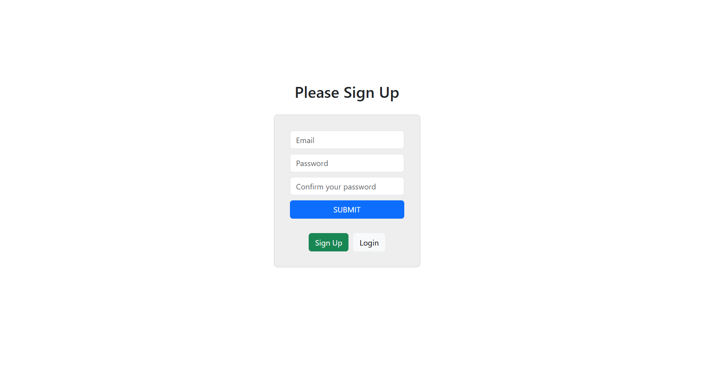

# ToDo List Application

## Overview
This project is a simple ToDo List application that allows users to securely log in, manage their tasks, and perform full CRUD (Create, Read, Update, Delete) operations on their personalised todo items.

## Table of Contents
- [Overview](#overview)
- [Screenshots](#screenshots)
- [Features](#features)
- [Technologies Used](#technologies-used)
- [Dependencies](#dependencies)
- [Challenges and Solutions](#challenges-and-solutions)
- [Installation Guide](#installation-guide)
- [Credit](#credit)

## Screenshots
<p align="center">
  
</p>
<p align="center"><em>Home page featuring user authentication</em></p>

<p align="center">
  
</p>
<p align="center"><em>Example of ToDo items</em></p>

## Features
* **Secure Authentication:** Users can securely log in. Upon authentication, a JSON Web Token (JWT) is generated and stored in an `httpOnly` and `secure` cookie for added security.
* **Edit and Delete:** Users can update or remove their existing todo items.
* **User-Specific Data:** All data is scoped to the authenticated user via backend-authenticated API.

## Technologies Used
### Frontend
* **ReactJS:** An open-source JavaScript library for building user interfaces
* **Bootstrap:** An open-source CSS framework designed for responsive, mobile first development
### Backend
* **Node.js**: To run JavaScript on the server-side of the application
### Database
* **PostgreSQL**: To create a database for the web application

## Dependencies
### Frontend
The directory structure of the client side of the application has been created using Vite. The full list of dependencies are as follows;
* **react:** Created by Vite to enable writing a React application 
* **react-dom:** Created by Vite to enable writing a React application 
* **axios:** To enable frontend to make http requests to the backend API of the application
### Backend
* **bcrypt:** To hash the passwords before storing them in a database
* **cookie-parser:** To access the JSON Web Token stored in a cookie
* **cors:** To enable the frontend Vite server to communicate with the backend API
* **dotenv:** To securely store sensitive information like the database credentials or API keys
* **express:** To create a backend API
* **jsonwebtoken:** To generate a JSON Web Token for user authentication/authorisation
* **pg:** To interact with the PostgreSQL from the backend

## Challenges and Solutions
## Backend

### Securely Storing JWT Without Exposing It to Frontend JS

**Challenge:**  
Avoid storing JWT tokens in localStorage or accessible client-side storage to prevent XSS attacks.

**Solution:**
- Store JWT as an `httpOnly` cookie so it’s inaccessible to frontend JavaScript but sent automatically with requests.
- Use backend middleware to decode the token from the cookie and authorise requests.

### Managing Cross-Origin Cookies and CORS Configuration
**Challenge:**  
Enable secure cookies to be sent between frontend (`localhost:5173`) and backend (`localhost:3000`) during development.  
**Solution:**
- Configure CORS with `credentials: true` on both backend and frontend requests.
- Set cookie options to `httpOnly: true`, `secure: true`, and `sameSite: 'none'` to allow cross-site cookies over https.

### Creating Authorisation Middleware
**Challenge:**  
Protect routes by verifying the JWT from cookies and attaching user info for use in route handlers.  
**Solution:**
- Write `authorise` middleware that verifies JWT, handles errors, and assigns decoded user info to `req.user`.
- Use this middleware on routes requiring authentication.

### Associating Todos With Users in the Database
**Challenge:**  
Ensure todos are linked to the user who created them and prevent unauthorized access.  
**Solution:**
- Use a `user_id` foreign key in the `items` table referencing `users.id`.
- Filter all todo queries by `req.user.id` to only return the logged-in user’s data.

### Password Hashing and Signup Validation
**Challenge:**  
Securely hash passwords before storing and prevent duplicate user registration.  
**Solution:**
- Use `bcrypt` to hash passwords asynchronously before database insertion.
- Check if a user already exists by email before allowing signup.

### Handling JWT Expiration
**Challenge:**  
Ensure users are logged out or prompted to reauthenticate after token expiration.  
**Solution:**
- Set JWT expiry to 1 hour.
- In middleware, reject requests with expired tokens, forcing re-login.

## Frontend

### Detecting Authentication Status Without Access to JWT Token
**Challenge:**  
React cannot read `httpOnly` cookies, so it can’t directly check login status.  
**Solution:**
- Call backend `/verify` endpoint with credentials on app load.
- Set React auth state (`isAuthenticated`, `email`) based on backend response.

### Conditional Data Fetching Based on Authentication
**Challenge:**  
Avoid fetching protected data (todos) before authentication is confirmed.  
**Solution:**
- Use separate hooks or conditional logic to fetch todos only if authenticated.

### Smooth UI Updates After Login, Logout, and Data Changes
**Challenge:**  
Reflect changes like item deletions or user logout immediately in UI without manual page reloads.  
**Solution:**
- Update React state (`items`, `isAuthenticated`) after actions to trigger UI re-render.
- On logout, reload page to clear all states and cookies.

### Handling Cross-Origin Requests with Cookies in Frontend
**Challenge:**  
Ensure cookies are sent and received properly during cross-origin API calls.  
**Solution:**
- Always use `withCredentials: true` in axios requests.
- Make sure your backend sets proper CORS headers with `credentials: true` and specific origin.


## Installation Guide
This project is located in the `ToDo List Application` directory of a larger repository called `portfolio`. It requires a `.env` file and a PostgreSQL database to run. To install and run the project, please follow the following steps;
1. Clone the repository:  
```bash
git clone https://github.com/nima-karkhaneh/portfolio.git
cd todo-list-application


```
2. Change directory to `client`:

`cd client`

3. In the client directory, install the dependencies:

`npm install`

4. Create a `.env` file in the client directory and fill it out with the following information;

```
VITE_API_URL_POST=http://localhost:3000/submit
VITE_API_URL_GET=http://localhost:3000/todos/
VITE_API_URL_DELETE=http://localhost:3000/todos/
VITE_API_URL_PUT=http://localhost:3000/todos/
VITE_API_URL=http://localhost:3000
VITE_API_URL_VERIFY=http://localhost:3000/verify
VITE_API_URL_SIGNOUT=http://localhost:3000/signout

```
5. Change directory to the root directory of the application:

`cd ../`

6. Install the dependencies:

`npm install`

7. Launch **pgAdmin** and connect to your PostgreSQL server. Create a new database followed by creating the following two tables:

```
CREATE TABLE users(
    id SERIAL PRIMARY KEY,
    email VARCHAR(200) NOT NULL,
    password VARCHAR(200)
);

CREATE TABLE items(
    id SERIAL PRIMARY KEY,
    user_id INTEGER REFERENCES users(id),
    description VARCHAR(200)
)

```
8. Create a `.env` file in the root of the project and replace the placeholders with your local PostgreSQL credentials and your JWT secret. Here is an example for your `.env` file:
```
DB_USER="Your PostgreSQL username (usually postgres unless you specified another)"
DB_HOST="localhost"
DB_DATABASE="The name of your database (e.g., my_project_db)"
DB_PASSWORD="Your PostgreSQL password"
DB_PORT="5432"
JWT_SECRET="Your own created JWT secret"
PORT="3000"

```
9. Run the backend API:

`node index.js`

10. Change directory to `client` and run the following command:

 `npm run dev`

11. Visit http://localhost:5173 in your browser to start the application.

## Credit

While this project was independently developed, a few online resources were referenced for learning purposes:

1. **PERN Stack Course** by *The Stoic Programmers* – This tutorial series offered a helpful introduction to building a ToDo app using the PERN stack. However, the tutorial stored JWT tokens in `localStorage`, which is insecure. My implementation significantly differs in that it uses `httpOnly` and `secure` cookies for authentication. While some frontend logic and Bootstrap styles are similar, my version features a different dashboard layout, includes user email display, and emphasizes security — which was not the focus of the tutorial.

2. **3hrs to Build and Deploy an Authenticated TO DO APP!** by *Code With Ania Kubow* – This tutorial demonstrated JWT-based authentication, but stored tokens in cookies accessible from React (i.e., not httpOnly). I used this resource for general structure inspiration but implemented secure cookie handling with `httpOnly` and `secure` flags to prevent client-side access — a key improvement in my version.

3. **The Complete Full-Stack Web Development Bootcamp** by *Dr. Angela Yu* (The App Brewery) – This Udemy course helped me build a solid foundation in React. However, it focused on frontend-only projects and server-rendered apps using EJS. Integrating React with a custom backend and PostgreSQL database was a challenge I pursued independently beyond the scope of the course.

This project reflects my initiative to go beyond tutorials by implementing secure authentication and building a fully functioning full-stack application from the ground up.


