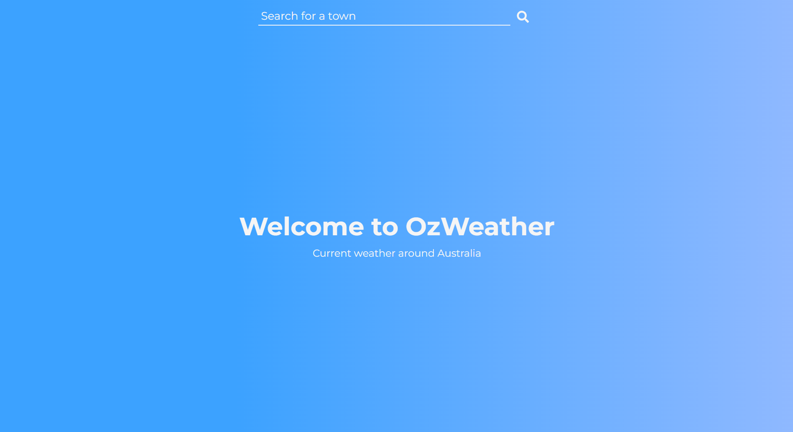
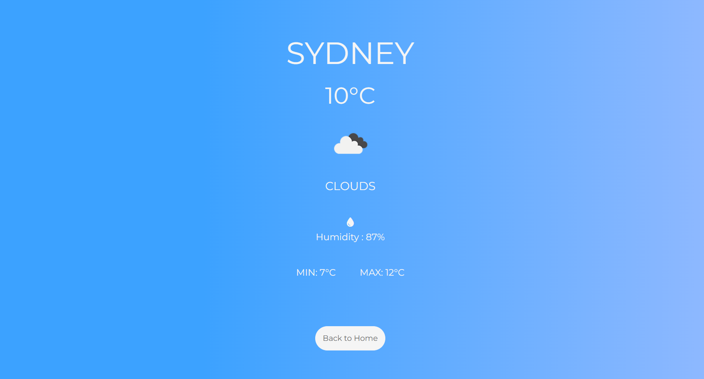
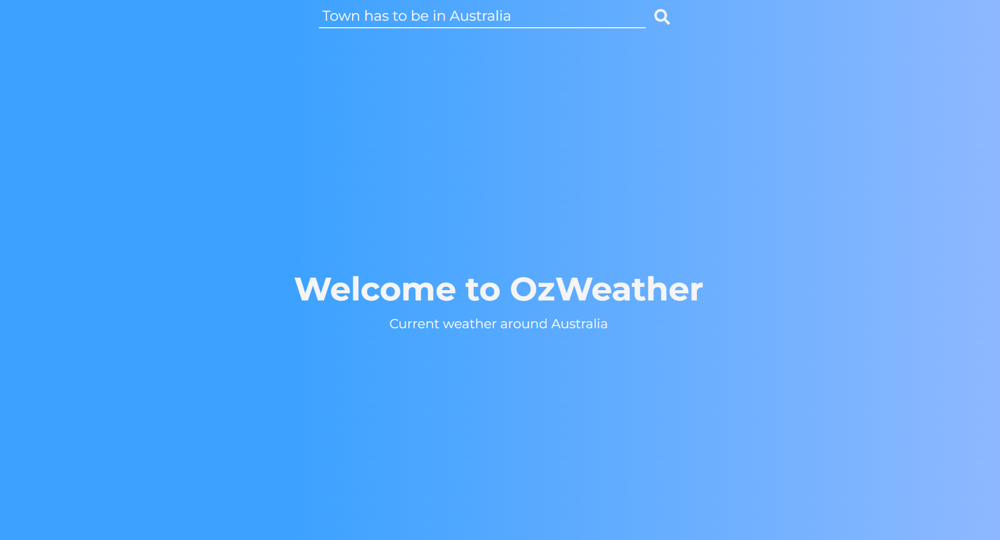

# OzWeather - Current Weather Around Australia

## Overview
**OzWeather** is a weather application that provides users with current weather information — including temperature, highs/lows, and humidity — for cities and towns within **Australia**.

## Screenshots

<p align="center">
  
</p>
<p align="center"><em>Home page.</em></p>

<p align="center">
  
</p>
<p align="center"><em>Example displaying weather data.</em></p>

<p align="center">
  
</p>
<p align="center"><em>Example displaying an error message.</em></p>

## Technologies Used

### Frontend
* **Embedded JavaScript (EJS):** To structure the content of the website and add some functionality
* **Cascading Style Sheets (CSS):** To style the content of the website including a responsive design

### Backend
* **Node.js**: To run JavaScript on the server-side of the application

## Dependencies
* **axios:** To make `htttp` requests to OpenWeatherMap API
* **dotenv:** To store the sensitive information such as the API key securely
* **express:** To build server-side of the application
* **ejs:**  To enable Embedded JavasScript

## Challenges and Solutions

### 1. Ensuring Accurate City Searches
**Challenge:**  
Some cities share the same name globally, leading to incorrect weather data.

**Solution:**  
Implemented a country code filter in the API request (`AU` for Australia) to ensure results are restricted to Australian locations only.

### 2. Robust Error Handling and Validation
**Challenge:**  
The original implementation lacked proper feedback for invalid inputs and failed API responses, making it unclear to users why their request didn’t work.

**Solution:**  
This app performs backend validation using regex and sends the appropriate HTTP status with user feedback rendered on the frontend. This ensures a more user-friendly and reliable experience.

### 3. Accurate Min/Max Temperature For the Next 24 Hour Period
**Challenge:**  
The initial logic relied on the current temperature to determine daily highs and lows, which led to unrealistic or misleading results — especially early in the day.

**Solution:**  
Implemented logic to calculate `tempMin` and `tempMax` using the 5-day/3-hour forecast API, filtered by local time. This resulted in more accurate, dynamic temperature ranges.

### 4. Timezone Offset & Local Time Conversion Fix
**Challenge:**  
Accurately converting forecast times from UTC to the city’s local time zone was complex, especially handling the timezone offset in seconds, ensuring displayed local times were correct for Australia’s multiple time zones.

**Solution:**  
Implemented a custom date formatting function that adds the OpenWeatherMap API’s timezone offset (in seconds) to the UTC date. Verified correctness extensively with console logs showing both UTC and local times. This was a non-trivial fix that ensures users see accurate local forecast times.

### 5. Full-Stack Design and Error Routing
**Challenge:**  
Many basic weather apps do not handle undefined routes, leading to generic or unhelpful error messages when users enter a wrong URL.

**Solution:**  
Built the app using Express routes, added a global catch-all route for undefined paths, and displayed a custom 404 page. The result is a well-structured full-stack application.

### 6. Form Visibility Logic After Submission
**Challenge:**  
After displaying the weather data, the form input should disappear for a better UI/UX.

**Solution:**  
Added conditional logic in the EJS form element to apply a `.invisible` class.
```ejs
<form action="/submit" method="post"
<% if (locals.city) { %>
class="invisible"
<% } %>>
    <input type="text" name="city" placeholder="Search for a town" autocomplete="off" required>
    <button class="search-btn" type="submit"></button>
</form>
```

### 7. Securing the API Key
**Challenge:**  
Risk of exposing sensitive API credentials in the codebase.

**Solution:**  
Used `dotenv` to load environment variables from a `.env` file and ensured `.env` was included in `.gitignore`.

### 8. Designing a Responsive UI Without a Framework
**Challenge:**  
Maintaining a clean and responsive design using only plain CSS.

**Solution:**  
Applied responsive design principles (like Flexbox) and media queries to ensure usability across devices.

## Installation Guide
This project is located in the `Weather application` directory of a larger repository called `portfolio`. It requires you to sign up to to the OpenWeatherMap API and obtain your own API key. You will also need a `.env` file to store your API key securely.
To sign up and obtain your API key, please visit the following website;  

https://openweathermap.org/api  

To install and use the project, please follow the following steps:
1. Clone the repository:
```bash
git clone https://github.com/nima-karkhaneh/portfolio.git
cd weather-application

```
2. Install the dependencies:  

`npm install`  

3. Create a `.env` file in the root directory of the project and replace the placeholders with your own API key. Here is an example of your `.env` file:
```
API_KEY="Your own API key"

```  
**Note:** Individual API keys are provided by OpenWeatherMap after signing up
4. Run the application:

`node index.js`

5. Visit http://localhost:3000 in your browser to start the application

## Credit
This project was developed independently as a capstone assignment for **The Complete Full-Stack Web Development Bootcamp** by **Angela Yu (The App Brewery)**.

Supplementary concepts were also reinforced through external learning, including the YouTube tutorial:  
*“Asynchronous JavaScript Course – Async/Await, Promises, Callbacks, Fetch API”* by **CodeLab98**.

While inspired by course objectives and tutorials, this app includes distinct features that make it a robust, independent portfolio project:
- Implements robust backend error handling and user feedback with HTTP status codes, unlike the tutorial’s frontend-only fetch with console logging.
- Accurately calculates daily minimum and maximum temperatures using the forecast API filtered by the local time, unlike the tutorial’s use of the current temperature only.
- Accurately handles timezone offset and local time conversion for Australian cities, a challenging fix to ensure correct forecast display.
- Built as a full-stack Express application with structured routing, including custom 404 error pages and catch-all middleware for undefined routes.
